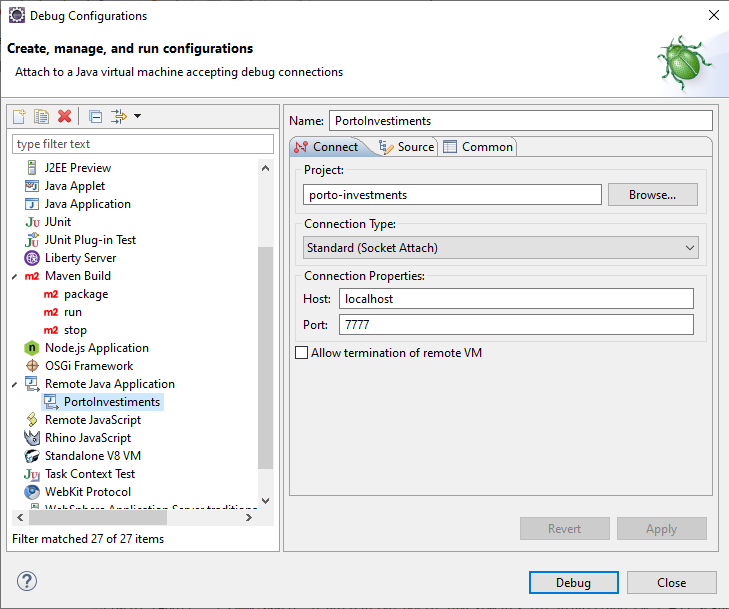

# Porto Seguro Investments é uma API desenvolvida com JAX-RS
Parabéns! Gostaríamos que você participasse deste desafio. Será um grande diferencial e um prazer enorme em participar desta fase com você, então vamos lá!

# Test back-end Porto Seguro
- Este teste busca avaliar quesitos técnicos para as pessoas que se candidatem as vagas de desenvolvimento back-end da Porto Seguro.

# O desafio
- Seu objetivo será criar um Resource para que possamos saber valor final de um investimento de longo prazo.
- A taxa de juros a ser utilizada será a taxa Selic e será obtida através de https://api.bcb.gov.br/dados/serie/bcdata.sgs.11/dados?formato=json&dataInicial={0}&dataFinal={1}.
- Você desenvolverá uma camada de serviço que utilizará um client rest para retornar a taxa atualizada.

# Existe um exemplo de uso de client rest no projeto: ZipPostalServiceImpl.
# Exemplo de busca de uma taxa atualizada:
- https://api.bcb.gov.br/dados/serie/bcdata.sgs.11/dados?formato=json&dataInicial=01/01/2020&dataFinal=01/01/2020

# Modelo de request:
- {"aporte-inicial": number; "aporte-mensal": number; "periodo-investimento": number}

# Modelo de response:
- {"aporte-inicial": number; "valor-futuro": number; "qtd-meses": number}

# Cálculo do valor futuro:

# Pré-requisitos:
- Jdk 1.8
- Apache Maven 3.3.9 ou superior
- Utilização do CDI (Commons dependency Injection);
- Utilização do padrão Restful (códigos de retorno, padrões de url e etc);
- Tratamento de exceções;

# Desejável (será considerado um diferencial)
- Criação de testes unitários: nada muito complexo ou extenso;

# O que será avaliado
- Padrões de classe, atributos e métodos;
- Conhecimento da linguagem, orientação a objetos, coesão e separação de conteúdos;
- Utilização dos padrões Restful;

# Para executar o projeto:
- mvn liberty:dev

# Para interromper a execução:
- CTRL + C;

# Para debugar:
- Dentro do eclipse, crie um remote debug: 

- Dentro do intellij, crie um remote debug: 

# BOA SORTE!!!